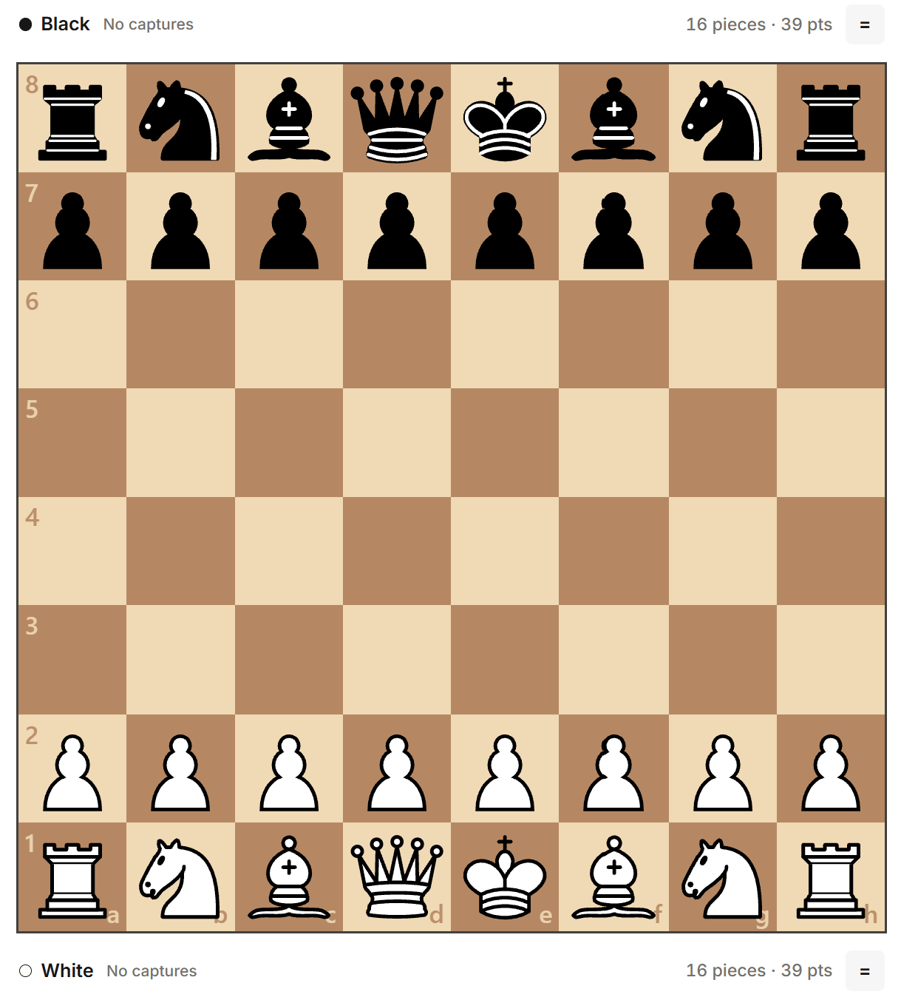

# Chessboard

`@mayazrakib/chessboard` is a framework-independent Web Component for playing, annotating, and replaying chess games. It uses `chess.js` for standard chess rules and works in plain HTML or alongside an application framework.

[Try the live playground.](https://playground.mayazrakib.com/chessboard/)



## Install

```sh
npm install @mayazrakib/chessboard
```

Import it once to register `<chess-board>`, then give it a width in your layout:

```ts
import "@mayazrakib/chessboard";
```

```html
<chess-board style="width: min(100%, 36rem)"></chess-board>
```

The root import loads the component, stylesheet, and piece sprite. Your bundler or static host must serve the package assets. Use the `/core` entry point for explicit registration and custom asset paths.

## Use

The board supports dragging, clicking, touch, and keyboard input. Shift+Arrow and Enter or Space moves pieces; Left and Down undo; Right and Up redo. Secondary click marks a square, and secondary drag draws an arrow.

Wait for the board before changing its options:

```ts
const board = document.querySelector("chess-board");

if (!board) {
    throw new Error("Failed to find the chessboard.");
}

await board.when_ready();
board.set_options({
    theme: "sage",
    interaction: { can_premove: true, },
});
```

`set_options()` applies partial configuration, and `get_options()` returns the resolved result. The component also accepts `fen`, `orientation`, `readonly`, `coordinates`, and `theme` attributes. Available themes are `brown`, `sage`, `slate`, and `linen`.

Use `get_position()` and `set_position()` for FEN, `get_pgn()` and `set_pgn()` for PGN, and `move()`, `move_uci()`, `undo()`, `redo()`, and `seek_history()` for game history. `set_annotations()` replaces marks or arrows in one named group. `PgnReplay` is exported from `@mayazrakib/chessboard/replay`.

Moves commit immediately by default. With `move_mode: "controlled"`, listen for `chessboard:move_request` and call `commit_move()` or `reject_move()`. The component emits events for moves, position changes, premoves, annotations, readiness, animations, game-over states, and errors.

## Develop

Start a local playground from a checkout:

```sh
npm ci
npm run dev
```

Run the checks before packaging:

```sh
npm run check
npm test
npm run test:browser
npm run test:package
```

`npm pack` creates an installable archive. See [package.json](package.json) for exports and [asset licensing](asset/LICENSING.md) for the piece art and sound terms.

## License

The library is [MIT licensed](LICENSE). CBurnett piece art and sound recordings have separate attribution and licence terms in [asset licensing](asset/LICENSING.md).
